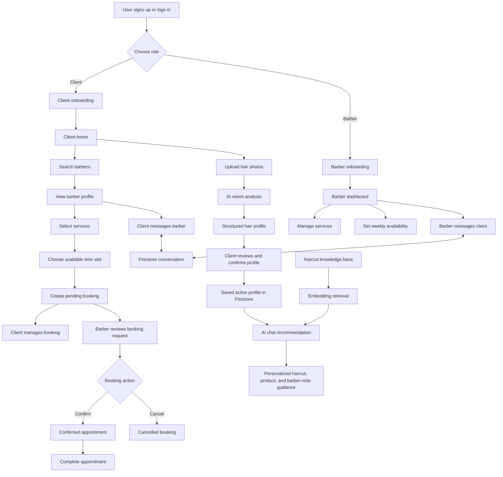

# CutCare

CutCare is an AI-powered barber platform built around a hair analysis pipeline that turns client hair photos into structured hair profile data. Clients upload multi-angle photos, review the generated profile, and then use a RAG-powered chatbot to get detailed, personalized haircut, styling, product, and barber-note recommendations based on their own hair information.

The product also supports the full barber-client workflow: clients can discover barbers, book appointments, manage bookings, and message barbers, while barbers can manage services, availability, client conversations, and booking requests from a dedicated business workflow.

## What I Built

- RAG-style haircut knowledge retrieval using SentenceTransformers embeddings and a curated haircut knowledge base
- FastAPI AI backend that analyzes uploaded hair photos, stores profile predictions, and supports profile-aware recommendations
- Real-time client/barber messaging with deterministic conversation threads
- AI hair profile upload flow with multi-angle photo support
- Client barber discovery, profile browsing, service selection, and booking creation
- Barber service management, weekly availability, and booking status workflows

## Product Flow



## AI System

The AI backend is built with FastAPI and supports two connected workflows:

- **Vision analysis:** validates uploaded photos, analyzes available photo angles, creates a unified structured hair profile, and stores the prediction under the client in Firestore.
- **Profile-aware recommendations:** loads the client's confirmed active hair profile, retrieves relevant haircut knowledge with embeddings, and builds a response grounded in both the user's question and the stored profile.

The RAG knowledge base currently focuses on haircut descriptions, barber communication guidance, and style recommendation context. The long-term direction is to expand the knowledge base with product recommendations, hair-care guides, and barber-facing client notes where appropriate.

## Client Experience

Clients can create an account, complete onboarding, search for barbers by profile and service information, book appointments from valid availability slots, manage upcoming bookings, and message barbers in real time.

The AI flow adds a more personalized layer: clients upload front, side, and back hair photos, receive a structured hair profile, review or correct the AI output, and then use that confirmed profile in the recommendation chat.

## Barber Experience

Barbers can create a business profile, list services, set weekly availability, review incoming booking requests, confirm or cancel appointments, mark appointments complete, and message clients. The barber side is designed around day-to-day business operations rather than a generic social profile.

## Tech Stack

- **Mobile:** React Native, Expo, Expo Router, NativeWind / Tailwind
- **Backend/data:** Firebase Authentication, Cloud Firestore, Firebase Storage
- **AI service:** FastAPI, Pydantic, OpenAI API integration, Pillow, OpenCV
- **Retrieval:** SentenceTransformers, NumPy, curated haircut knowledge documents
- **Tooling:** TypeScript, JavaScript, Python

## Repository Structure

```txt
frontend/   React Native / Expo mobile app
ai/         FastAPI AI service for vision analysis and recommendations
functions/  Firebase Cloud Functions workspace
website/    Web workspace
```

## Current Status

Implemented:

- Authentication and persistent login
- Role-based routing and onboarding
- Client and barber profile flows
- Barber services and availability management
- Client discovery and booking creation
- Barber booking management
- Real-time messaging
- Hair profile upload, analysis, review, confirmation, and storage
- Profile-aware AI chat with embedded haircut knowledge retrieval
