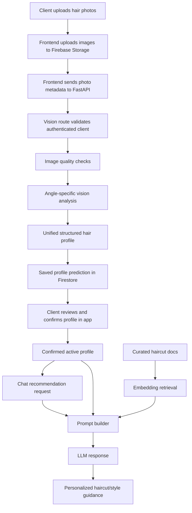

# CutCare AI Backend

This folder contains the FastAPI service that powers CutCare's AI hair profile and recommendation features.

## Current Features

- FastAPI API with health, status, vision, and chat routes
- Firebase-aware auth checks for client-scoped AI requests
- Multi-angle hair photo analysis flow for front, left, right, and back images
- Image validation for duplicate, size, blur, and lighting checks
- Structured AI hair profile generation and unification
- Firestore storage for AI predictions under `clients/{clientId}/hairProfiles/{profileId}`
- Client-confirmed active hair profile loading
- Profile-aware recommendation chat
- RAG-style haircut knowledge retrieval using SentenceTransformers embeddings
- Curated haircut knowledge documents and local embedding index

## AI Flow



## API Surface

- `GET /health` - health check
- `GET /status` - service readiness and configuration status
- `POST /vision/analyze-profile` - analyzes uploaded hair photos and stores a profile prediction
- `POST /chat/recommend` - generates profile-aware haircut and styling guidance

## Data Model

Hair profile predictions are stored under:

```txt
clients/{clientId}/hairProfiles/{profileId}
```

Each profile stores:

- original AI prediction
- confirmed profile, once reviewed by the client
- review status
- edited fields
- photo coverage
- source photo metadata
- model metadata
- created and updated timestamps

The active confirmed profile is referenced from:

```txt
clients/{clientId}.aiHairProfile.activeProfileId
```

## RAG Knowledge

The recommendation chat retrieves relevant documents from:

```txt
ai/data/rag_docs/haircuts.json
ai/data/rag_index/haircuts_index.npz
```

Retrieval combines the user's message with confirmed hair profile fields, then uses SentenceTransformers embeddings to select the most relevant haircut knowledge for the final response.

## Folder Structure

```txt
ai/
  app/
    core/       config, Firebase, auth helpers
    models/     request/response and profile schemas
    routes/     health, status, vision, chat endpoints
    services/   vision, profile storage, RAG, prompt, LLM services
  data/
    rag_docs/   curated haircut knowledge
    rag_index/  local embedding index
  requirements.txt
```

## Running Locally

```bash
python -m venv .venv
source .venv/bin/activate
pip install -r requirements.txt
uvicorn app.main:app --reload
```

Copy `.env.example` to `.env` and fill in the required Firebase and AI service settings before running authenticated profile storage or chat requests.
